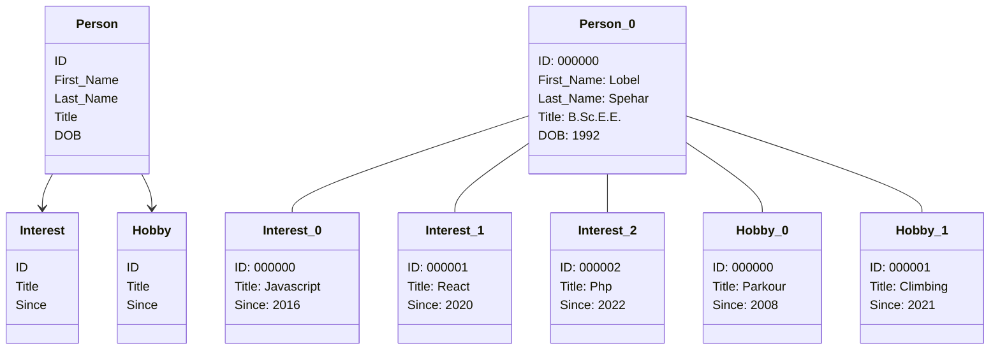

<h1 align="center">
  Hello world
  <picture>
    
  </picture>
</h1>

  <picture>
    
  </picture>

  

   

 <picture>
  
 </picture>
 <picture>
  
 </picture>

 

  <picture>
    &nbsp;
  </picture>
  <picture>
    &nbsp;
  </picture>
  <picture>
    &nbsp;
  </picture>
  <picture>
    &nbsp;
  </picture>
  <picture>
    &nbsp;
  </picture>
  <picture>
    &nbsp;
  </picture>
  <picture>
    
  </picture>
  <picture>
    &nbsp;
  </picture>
  <picture>
    
  </picture>

